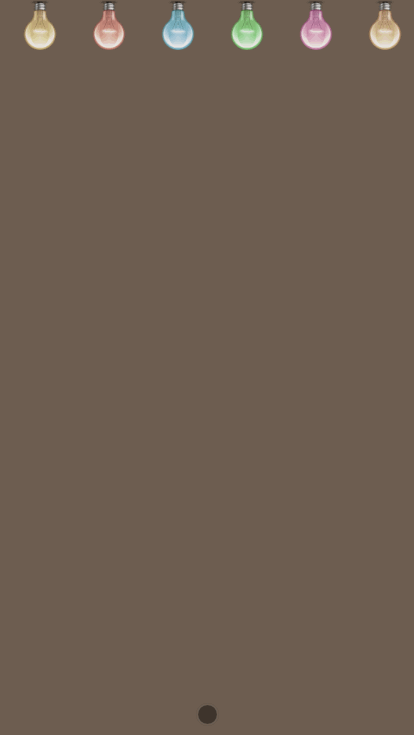

happy Birthday
Modify the configuration of config.js to make a super creative web page for your beloved. Happy birthday, if you like, fork or star~

TODO
 Each line of blessing text can be accompanied by a picture
 Picture support rotation
config.js description
Reminder: Every sentence, every picture address, every button text line must end with a comma at the end!

var config = {
    // The length of the sentence can be any, you can write ten sentences or 20 sentences
    // Try not to exceed 15 words in each sentence, otherwise the display effect may not be very good
    texts: [
        "Give it to me",
        "Beloved Little Cutie",
        "Today is your birthday",
        "This is where we are together",
        "It's the third birthday",
        "Last year's birthday",
        "Remember what I ate at Wang Po Chuan Chuan",
        "I want to eat well this year",
        "I want to feed my lovely pigs",
        "Then take away",
        "YAMI~~",
    ],
    /**
     * imgs can be left blank, but if you want to fill in, you must follow the format below
     * "Correspond to the above text, it must be exactly the same": "Picture address, you can put the picture in the imgs folder"
     * E.g
     * "Beloved little cute": "./imgs/xiaokeai.jpg"
     *
     * If you don't want pictures, just write two slash comments at the beginning of each line. For example, the picture below "Today is your birthday" will not be displayed :)
     * Tip: The picture is best to use a square or close to a square, it looks better
     */
    imgs: {
        "Beloved little cute": "./imgs/xiaokeai.png",
        // "Today is your birthday": "./imgs/birthday.jpg",
    },
    // Button text description, the following is the default button text, in English, you can change it to your favorite text
    desc: {
        turn_on: "Start",
        play: "Music",
        bannar_coming: "Color",
        balloons_flying: "It seems that there are few things",
        cake_fadein: "Cake?",
        light_candle: "Candle?",
        wish_message: "Happy Birthday",
        story: "A MESSAGE FOR YOU",
    }
};
Screenshot demo

Zhihu tutorial
https://zhuanlan.zhihu.com/p/85899661

end
If you like, pay attention to Badu and Aotian~
Regularly update love web templates, resume templates, knowledge notes, PDF books, original in-depth technology sharing, etc. ❤️

Knowing: Domination, Aotian
Github: Badu, Aotian
QA
How to modify the music?

Answer: Overwrite the hbd.mp3 under the assets directory with your own mp3 music file, remember to have the same name after overwriting!

link
The first issue: Love Tree 🌴 Treasure the moment of love forever (WeChat, QQ can be viewed perfectly)
Phase 2: 🍰Change the data and make a super creative web birthday greetings for your loved one~ (Happy Birthday)
Phase 3: 🎈Coffee on the left bank of the Seine. The confession balloon flew into my heart.